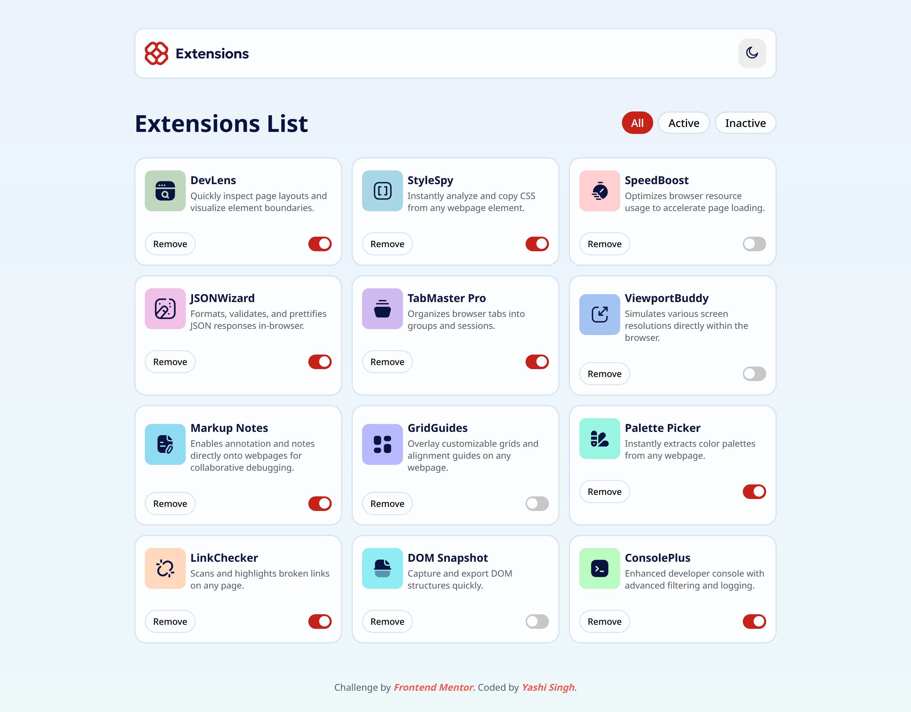
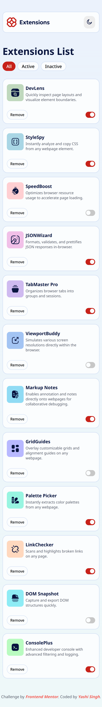

# Frontend Mentor - Browser Extensions Manager UI Solution

This is a solution to the [Browser extensions manager UI challenge on Frontend Mentor](https://www.frontendmentor.io/challenges/browser-extension-manager-ui-yNZnOfsMAp). Frontend Mentor challenges help you improve your coding skills by building realistic projects.

## Table of contents

* [Overview](#overview)

  * [The challenge](#the-challenge)
  * [Screenshot](#screenshot)
  * [Links](#links)
* [My process](#my-process)

  * [Built with](#built-with)
  * [What I learned](#what-i-learned)
  * [Continued development](#continued-development)
  * [Useful resources](#useful-resources)
* [Author](#author)
* [Acknowledgments](#acknowledgments)
* [Installation & Setup](#installation--setup)

## Overview

### The challenge

Users should be able to:

* Toggle extensions between active and inactive states
* Filter active and inactive extensions
* Remove extensions from the list
* Select their color theme
* View the optimal layout for the interface depending on their device's screen size
* See hover and focus states for all interactive elements on the page

### Screenshot

** Desktop Design **


** Mobile Design **


### Links

* Solution URL: [Add solution URL here](https://your-solution-url.com)
* Live Site URL: [Add live site URL here](https://your-live-site-url.com)

## My process

### Built with

* Semantic HTML5 markup
* Stylus (CSS Preprocessor)
* Flexbox
* CSS Grid
* Mobile-first workflow
* JavaScript (Vanilla)
* Data fetched from `data.json`

### What I learned

During this project, I learned the importance of **dynamic rendering** using JavaScript, especially when managing a list of items with multiple states (active/inactive). I also gained a deeper understanding of **fetching data from a JSON file** and dynamically rendering content based on user actions like toggling and filtering.

Here’s an example of how the data is rendered dynamically:

```js
const extCard = document.createElement("div");
extCard.classList.add("extension");
extCard.innerHTML = `
  <div class="info">
    
    <div>
      <h3>${ext.name}</h3>
      <p>${ext.description}</p>
    </div>
  </div>
  <div class="btns-info">
    <button class="remove-btn">Remove</button>
    <input type="checkbox" ${ext.isActive ? "checked" : ""}>
  </div>
`;
```

### Continued development

For future improvements, I plan to:

* Implement user authentication to allow users to save their list of extensions across sessions.
* Explore **local storage** or **server-side databases** to save the state of the extensions.
* Enhance the **UI** with more interactive elements like hover effects and animations.

### Useful resources

* [Frontend Mentor Documentation](https://www.frontendmentor.io/docs) - The official documentation of Frontend Mentor was a great help in understanding the challenge requirements and guidelines.
* [Stylus Documentation](https://stylus-lang.com/docs/) - Understanding Stylus syntax was essential to styling the project efficiently.

## Author

* Frontend Mentor - [Yashi-Singh-9](https://www.frontendmentor.io/profile/Yashi-Singh-9)
* LinkedIn - [Yashi Singh](https://www.linkedin.com/in/yashi-singh-b4143a246)

## Acknowledgments

Special thanks to the [Frontend Mentor community](https://www.frontendmentor.io) for providing such a well-structured challenge and helping me learn new concepts through practical application.

## Installation & Setup

### Prerequisites

* Ensure you have **Stylus** installed as the CSS preprocessor for the project. You can install it globally or use it with a build tool.

### Install Stylus

1. Install **Stylus** globally using npm:

   ```bash
   npm install -g stylus
   ```

2. Alternatively, you can install Stylus locally within your project:

   ```bash
   npm install stylus --save-dev
   ```

### Run the Project

1. Clone the repository:

   ```bash
   git clone https://github.com/Yashi-Singh-9/Browser-Extension-Manager-UI.git
   ```

2. Navigate to the project directory:

   ```bash
   cd Browser-Extension-Manager-UI
   ```

3. To compile the Stylus file to CSS, run:

   ```bash
   stylus style.styl -o style.css
   ```

4. Open `index.html` in your browser to view the project.